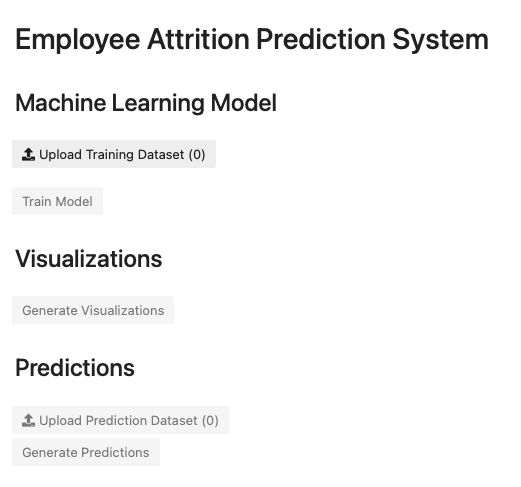
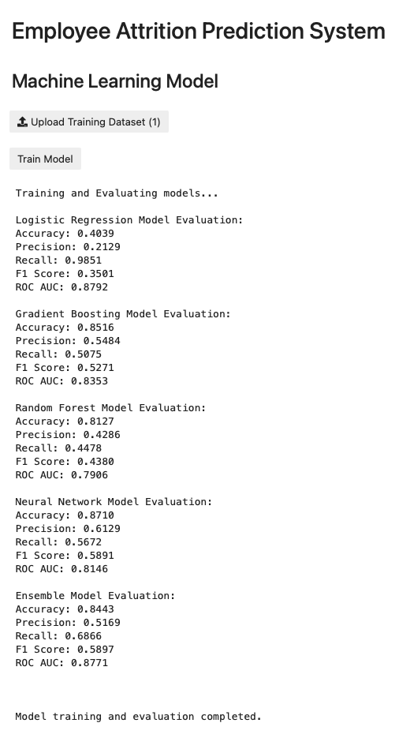
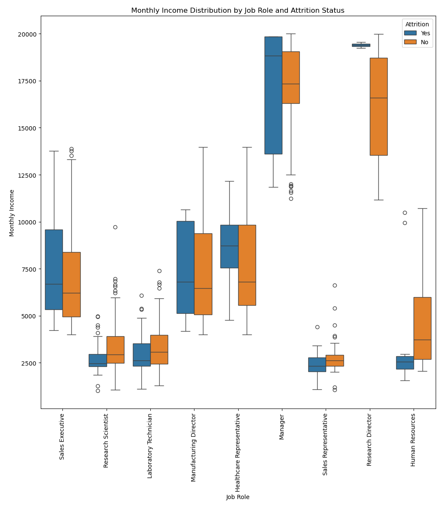
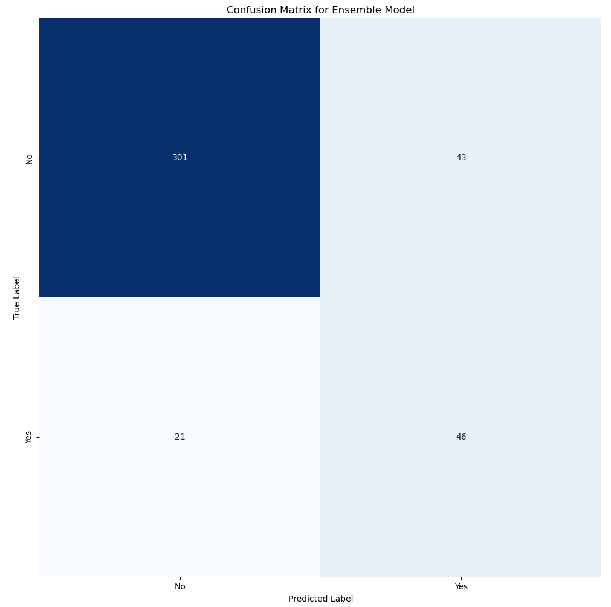
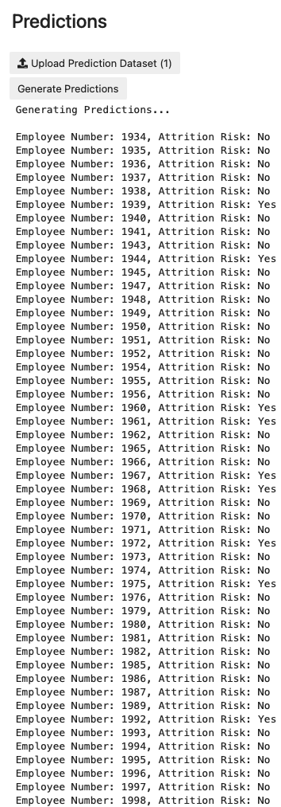

<!-- # Employee Attrition Predictor

## Overview
The Employee Attrition Prediction System is designed to harness the power of machine learning to predict potential employee turnover within organizations. By analyzing historical data, this system identifies patterns and predictors of attrition, enabling HR departments to implement proactive measures to increase retention. The system is built in Python, utilizing a Jupyter Notebook for an interactive analysis and modeling experience.

## Major Features

### Machine Learning Model
- Incorporates a suite of machine learning models including Logistic Regression, Gradient Boosting, Random Forest, and Neural Networks to analyze and predict employee attrition.
- Utilizes a VotingClassifier for ensemble learning, combining predictions from individual models to improve accuracy.
- Employs a dynamic threshold for classification to balance precision and recall, optimizing the F1 score.

### Data Preprocessing
- Features comprehensive data preprocessing steps including feature scaling, one-hot encoding for categorical variables, and dropping irrelevant features to enhance model performance.
- Implements a custom preprocessing pipeline to automate the transformation of training and prediction datasets.

### Model Evaluation
- Detailed evaluation of model performance using metrics such as accuracy, precision, recall, F1 score, and ROC AUC.
- Visualizes confusion matrices for a clear understanding of model prediction capabilities.

### Visualizations
- Generates insightful visualizations to explore the correlation between various features and attrition, including correlation coefficients and income distribution by job role and attrition status.

### Predictions
- Offers functionality to upload new datasets for prediction, applying the trained ensemble model to estimate attrition risks for current employees.

## Programming Concepts

### Interactive Widgets
- Integrates ipywidgets to create interactive elements within the Jupyter Notebook, such as file upload buttons for training and prediction datasets, enhancing user engagement.

### Preprocessing and Modeling Pipelines
- Leverages Scikit-learn pipelines for efficient data preprocessing and model fitting, ensuring a streamlined workflow from raw data to predictions.

### Ensemble Learning
- Demonstrates the application of ensemble learning techniques, combining the strengths of multiple models to achieve higher prediction accuracy.

## Data Structures Used

### Pandas DataFrames
- Utilizes Pandas for data manipulation and analysis, enabling efficient handling of datasets throughout the preprocessing and modeling stages.

### NumPy Arrays
- Employs NumPy for numerical operations, particularly in the preprocessing steps to apply transformations to the data.

### Scikit-learn Objects
- Uses various Scikit-learn objects for machine learning tasks, including models, transformers, and pipelines, facilitating a structured approach to model development and evaluation.
-->

# Employee Attrition Prediction System

## Overview

The Employee Attrition Prediction System is a predictive tool aimed at forecasting employee turnover within organizations. Utilizing machine learning algorithms, this system analyzes historical employee data to identify patterns and predictors of attrition. The implementation is encapsulated in a Jupyter Notebook, providing an interactive environment for data exploration, model training, and prediction. With its focus on data-driven insights, the system enables stakeholders to understand and mitigate factors contributing to employee attrition. The system is able to predict future employee attrition with an accuracy approaching 85% while maintaining a balance between false positives and false negatives. The tool is hosted as a web app and can also be installed locally.

## Major Features

- **Machine Learning Model**: Incorporates a suite of machine learning models including Logistic Regression, Gradient Boosting, Random Forest, and Neural Networks in an ensemble to analyze and predict employee attrition.
- **Data Visualization**: Integrated visualizations to interpret the data and model outcomes, showcasing trends, feature importances, and prediction accuracies, thus facilitating strategic decision-making.
- **Predictive Analytics**: Application of the model to unseen data for predicting future attrition, allowing for proactive measures to enhance employee retention strategies.
- **Data Preprocessing and Exploration**: Tools and techniques for cleaning, transforming, and analyzing the dataset, ensuring optimal model performance.

## Programming Concepts

- **Data Science Workflow**: Incorporates a comprehensive workflow from data preprocessing and exploration to machine learning modeling and prediction.
- **Machine Learning Pipelines**: Utilizes pipelines for efficient data preprocessing, model training, and evaluation.
- **Ensemble Learning**: Demonstrates the application of ensemble learning techniques, combining the strengths of multiple machine learning models to achieve higher prediction accuracy.
- **Visualization Techniques**: Employs libraries for generating insightful visualizations, aiding in the understanding and communication of data insights and model predictions.
- **Hyperparameter Tuning**: Hyperaparameter tuning was conducted utilizing grid search with cross-validation (GridSearchCV) to select model hyperparameters that resulted in optimal evaluation metrics.
- **Scripts for Windows Environment Installation and Program Launch**: Includes batch scripts for setting up the project environment and launching the application, ensuring ease of use and reproducibility across Windows platforms.

## Key Technologies

- **Python**: The primary programming language for developing the prediction system, chosen for its rich ecosystem of data science libraries.
- **Jupyter Notebook**: Provides an interactive development environment for documenting the data science process, combining executable code with descriptive text and visualizations.
- **Pandas**: A data analysis library extensively used in machine learning applications.
- **Numpy**: A scientific computing library that provides advanced support for mathematical operations.
- **Scikit-learn**: A machine learning library used for training predictive models, conducting data preprocessing, and evaluating model performance.
- **Matplotlib/Seaborn**: Visualization libraries for creating informative plots to analyze the data and results.

## Instructions

1. Download the training and prediction datasets to your device. These datasets are located in the "data" directory.
2. Launch the tool by clicking on the "launch binder" button, located at the top of this README. The application may take several minutes to launch in your web browser.
3. Click the **"Upload Training Dataset"** button. Navigate to the training_dataset.csv file that was downloaded in step 1, select it, and click open. **Note**: Pay special attention not to mix up the training and prediction datasets. Attempting to train the model using the prediction dataset, or attempting to generate predictions with the training dataset, will result in an error due to differences in the fields contained in each file.
4. Click the **“Train Model”** button. This will start the model training process. The evaluation metrics for each sub-model will be shown as they are calculated. Once the model is finished training, the message “Model training and evaluation completed.” will appear. This may take several minutes.
5. Click the **“Generate Visualizations”** button to generate a correlation table, income distribution table, and confusion matrix for the final trained model. Note: If the button is clicked after training data has been uploaded but before model training is completed, only the correlation table and income distribution tables will be generated, since the confusion matrix requires a trained model to be generated.
6. Click the **“Upload Prediction Dataset”** button. Just as in step 3, be careful not to mix up the prediction and training datasets. Navigate to the folder containing the prediction dataset that was downloaded in step 1, select it, and click open.
7. Click the **“Generate Predictions”** button. A list of employees from the prediction dataset, identified by their employee numbers, will be listed along with a prediction of whether the employee is an attrition risk.

## Screenshots

    
     <b>Figure 1.</b> Home Page

---

    
     <b>Figure 2.</b> Model Evaluation Metrics

---

    
     <b>Figure 3.</b> Correlation Graph

---

    
     <b>Figure 4.</b> Income Box and Whisker Plot

---

    
     <b>Figure 5.</b> Confusion Matrix

---

    
     <b>Figure 6.</b> Attrition Predictions

